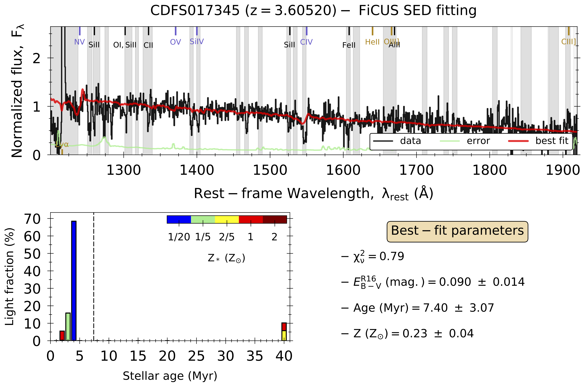

# `FiCUS` (FItting the stellar Continuum of Uv Spectra) 
- [Description](README.md#description)
- [Installation](README.md#installation)
- [Input and Configuration files](README.md#input-and-configuration-files)
- [Running FiCUS](README.md#running-ficus)
- [Outputs and Plots](README.md#outputs-and-plots)
- [Referencing FiCUS](README.md#referencing-ficus)
- [Licencing](README.md#licencing)
- [Acknowledgments and Contributions](README.md#Acknowledgments-and-contributions)
- [Change Log and Updates](README.md#change-log-and-updates)

## Description
`FiCUS` is a `Python` script to fit the stellar continuum of extragalactic ultraviolet (UV) spectra. In short, it takes observed-frame wavelength, flux density (with errors) and user-defined mask arrays as inputs, and returns an estimation of the galaxy stellar age, metallicity and dust extinction, as well as other secondary Spectral Energy Distribution (SED) parameters. The code was presented in [Saldana-Lopez et al. 2023](https://ui.adsabs.harvard.edu/abs/2022arXiv221101351S/abstract), but the methodology was first described and tested in [Chisholm et al. 2019](https://ui.adsabs.harvard.edu/abs/2019ApJ...882..182C/abstract).

The UV stellar continuum modeling ( $F_{\lambda}^{\star}$ ) is achieved by fitting the observed spectra with a linear combination of single-burst stellar population (SSP) theoretical models: `Starburst99`[^1] ([Leitherer et al. 2010](https://ui.adsabs.harvard.edu/abs/2010ApJS..189..309L/abstract), for single stars), `BPASSv2.2.1`[^2] ([Eldridge et al. 2017](https://ui.adsabs.harvard.edu/abs/2017PASA...34...58E/abstract), for binaries), or `Starburst99+stripped`[^3] ([Gotberg et al. 2019](https://ui.adsabs.harvard.edu/abs/2019A%26A...629A.134G/abstract), for stripped star models). These models assume a initial mass function (IMF) with a high-(low-)mass exponent of 2.3 (1.3), and a high-mass cutoff at $100 M_{\odot}$. The models include five different metallicities (0.1, 0.2, 0.5, and 1 $Z_{\odot}$) and ten ages for each metallicity (1, 2, 3, 4, 5, 8, 10, 15, 20 and 40 Myr). A nebular continuum was added to every model by self-consistently processing the original SSPs through `Cloudy v17.0`[^4] ([Ferland et al. 2017](https://ui.adsabs.harvard.edu/abs/2017RMxAA..53..385F/abstract)), assuming similar gas-phase and stellar metallicities, an ionization parameter of $\log(U)=-2.5$, and a volume hydrogen density of $n_H = 100 cm^{-3}$. Adopting a simple geometry where _all_ the light is attenuated by a uniform foreground slab of dust, the modeled stellar continuum results in: 

$$ F_{\lambda}^{\star} = 10^{-0.4 k_{\lambda} E_{B-V}} \sum_{i,j} X_{ij} F_{\lambda}^{ij} $$

$$ i \equiv 1, 2, 3, 4, 5, 8, 10, 15, 20, 40 Myr $$

$$ j \equiv 0.1, 0.2, 0.5, 1 Z_{\odot} $$

... where $F_{\lambda}^{ij}$ represents the i-_th_ age and j-_th_ metallicity model, and the $X_{ij}$ linear coefficients determine the weight of every model within the fit. $k_{\lambda}$ is given by the dust-attenuation law (either [Reddy et al. 2016](https://ui.adsabs.harvard.edu/abs/2016ApJ...828..107R/abstract) or SMC, [Prevot et al. 1984](https://ui.adsabs.harvard.edu/abs/1984A%26A...132..389P/abstract)), and $E_{B-V}$ is the so-called dust-attenuation parameter (in magnitudes). 

Finally, the best fit is chosen via a non-linear $\chi^2$ minimization algorithm with respect to the observed data (`lmfit` package[^5], see [Newville et al. 2016](https://ui.adsabs.harvard.edu/abs/2016ascl.soft06014N/abstract)), and the errors are derived in a Monte-Carlo (MC) way, varying the observed pixel fluxes by a Gaussian distribution whose mean is zero and standard deviation is the $1 \sigma$ error of the flux at the same pixel, then re-fitting the continuum over a certain number of iterations.

$$ - $$

- The code is composed of two `.py` files:
  - ```ficus.py``` is the **main** script. It reads the INPUT file provided by the user, and performs the fit according to the options enclosed in the CONFIGURATION file (see [Input and Configuration files](README.md#input-and-configuration-files)). It gives the best-fit parameters, creates the OUTPUT files and figures (see [Outputs and Plots](README.md#outputs-and-plots)). 
  - ```ficus_scripts.py``` is a **secondary** script. After being called, all the functions are imported into the main script. This file includes pre-defined routines for spectral analysis, loading INPUT files and handling with data and models, as well as functions for the fitting routine, SED-parameters calculations and plotting. 

## Installation
`FiCUS` is written in `Python` language. Before installing the code, the working environment must be equipped with the following packages, that otherwise can be easily installed/updated using [pip](https://pypi.org/project/pip/), [conda](https://docs.conda.io/en/latest/) or any other package manager:
```
> python 3.7.4 
> matplotlib 3.1.1 
> astropy 4.0 
> lmfit 1.0.0 
```

... or later versions. Once the previous dependencies are updated, `FiCUS` can be cloned from this repository using [git](https://git-scm.com/), by just plugging into the terminal the following command (the option '--depth 1' avoids downloading the entire repository history):
```
> git clone --depth 1 https://github.com/asalda/FiCUS
```

## Input and Configuration files
- The **INPUT** `.fits` file must contain, after an empty Primary() HDU, the following four columns in the first extension: 
  - 'WAVE'.......... observed-frame wavelength array, in \AA, 
  - 'FLUX'........... spectral flux-density, in $F_{\lambda}$ units (erg/s/cm2/AA), 
  - 'FLUX_ERR'... $1 \sigma$ error on the spectral flux-density, 
  - 'MASK'.......... mask array (0 = masked, 1 = un-masked).
  
  The INPUT file can, for example, inherit the name of the spectrum to be fitted, and must always be placed into the [/FiCUS/inputs/](inputs/) folder beforehand. The 'MASK' extension of the INPUT file is a binary-array of the same length as 'WAVE', and indicates whether the 'FLUX' and 'FLUX_ERR' values at a certain wavelength ( $\lambda_i$ ) will be excluded (0 = masked) or considered (1 = un-masked) in the fit. 

- The **CONFIGURATION** `.ini` file specifies the input parameters and options that feed the main code  (see [ficus.ini](ficus.ini)):
  
| Input | Description | Options/Format | 
| --- | --- | --- |
| `ssp_models` | pick your preferred stellar LIBRARY | `sb99` (single) // `bpass` (binaries) // `sb99stripped` (stripped) |
| `neb_mode` | add or remove the NEBULAR continuum contribution | `on` // `off` |
| `zarray` | specify a set of METALLICITIES | `0001,0002,0008,0014` (0.1, 0.2, 0.5, and 1 $Z_{\odot}$) |
| `att_law` | choose the DUST attenuation law | `r16` (Reddy et al. 2016) // `smc` (Prevot et al. 1994) |
| `wave_range` | rest-WAVELENGTH range included the fit | $\lambda_{min}, \lambda_{max}$ (in \AA) |
| `wave_norm` | rest-wavelength interval for NORMALIZATION of the spectra | $\lambda_{min}, \lambda_{max}$ (in \AA) |
| `r_obs` | instrumental RESOLUTION of the input spectra ( $R = \lambda / \Delta \lambda$ ) | number |
| `nsim` | number of Monte-Carlo (MC) ITERATIONS | number |
| `plot_mode` | activate or desactivate PLOTTING mode | `yes` // `no` |

Examples of the INPUT and CONFIGURATION files can be found at the [/FiCUS/examples/](examples/) dedicated folder: [CDFS017345.fits](examples/) and [CDFS017345.ini](examples/CDFS017345.ini), respectively. 

## Running FiCUS
Given the name of the INPUT file (`SPEC-NAME`) and the redshift of the source (`REDSHIFT`), the code can be run in console as a normal `.py` script:
```
> python3.7 ficus-path/FiCUS/ficus.py SPEC-NAME REDSHIFT
```

... where `ficus-path/` corresponds to the local path in which the code was initially placed (see [Installation](README.md#installation)). The code also works within a jupyter-notebook environment (`.ipynb`) using the magic command `%run`:
```
> import os
> os.chdir(path-to-ficus/FiCUS/);
> %run -i ficus.py SPEC-NAME REDSHIFT
```

After a successful run, the terminal will print the name of the INPUT file followed by the list of input parameters selected in the CONFIGURATION file. Succesfull fits will prompt the quote `# done!` when the process is finished. A typical console interface would be like this:
```
> python3.7 ficus.py CDFS017345 3.6052

 ############################################################## 
 
 ###   FiCUS: Fitting the stellar Continuum of Uv Spectra   ### 
 
 ############################################################## 
   
 ### Running FiCUS (ficus.py) for CDFS017345.fits ...
 
 ### inputs ### 
 # spec_name   --> CDFS017345
 # z_spec      --> 3.6052
 # neb_mode    --> off
 # ssp_models  --> sb99
 # Zarray      --> ['0001','0002','0008','0014']
 # att_law     --> r16
 # wave_range  --> [1200. 1920.]
 # wave_norm   --> [1350. 1370.]
 # r_obs       --> 600.0
 # nsim        --> 100
 # plot_mode   --> yes
 
 ### plotting...   
   
 # done!
```
... in which the continuum SED for the CDFS017345 VANDELS spectrum at z = 3.6052 (example taken from [Saldana-Lopez et al. 2023](https://ui.adsabs.harvard.edu/abs/2022arXiv221101351S/abstract)) is modeled using the `Starburst99` stellar library and a set of x4 metallicities (0.05, 0.2, 0.4, $1 Z_{\odot}$), excluding contributions from the nebular continuum. Dust attenuates the stellar continuum following the [Reddy et al. 2016](https://ui.adsabs.harvard.edu/abs/2016ApJ...828..107R/abstract) prescription. The wavelength range considered in the fit is $1200-1920$ angstroms, and the output SEDs are normalized to $1350-1370$ angstroms. The VANDELS resolution is $R = 600$, and the number of MC realizations is set to 100. 

## Outputs and Plots
Multiple **OUTPUT** files in `.txt` and `.npy` formats are generated into the [/FiCUS/outputs/](outputs/) directory, sorted and named by date. On the one hand, `.txt` files are easily readable and contain self-explanatory information (see commented lines in files) about the output parameters and SEDs. Concretely: 
  - `*_ficus_lightracs.txt`: includes the best-fit light-fractions ( $X_{ij}$ ), with errors, 
  - `*_ficus_params.txt`: lists the secondary SED parameters, with errors (see comments for actual definitions and units), 
  - `*_ficus_SPEC.txt`: stores the original spectrum and best-fit stellar continuum, with errors, 
  - `*_ficus_SED.txt`: contains the attenuated and dust-free stellar SEDs, extended to the _whole_ wavelength range of the stellar libraries. 

On the other hand, `.npy` files store the same results but for every MC iteration of the fit, in a similar format as the previous text files. 

Finally, if `plot_mode == yes`, the code generates a deafult **PLOT** in `.pdf`, with the same name as the INPUT file. This file is saved into [/FiCUS/outputs/](outputs/), and it constitutes of three main panels: 
1. (_Top:_) displays the (normalized) observed and error spectrum as well as the best-fit stellar continuum; a bunch of default stellar, nebular and interstellar medium (ISM) lines are identified; 
2. (_Bottom left:_) shows histograms with the best-fit light-fractions as a function of stellar age and metallicity; 
3. (_Bottom right:_) inclcudes a summary chart with the main best-fit parameters. 

An example of `FiCUS`'s plot for the previous CDFS017345 ([Saldana-Lopez et al. 2023](https://ui.adsabs.harvard.edu/abs/2022arXiv221101351S/abstract)) is visualized below. 



## Referencing `FiCUS`
This code has been made publicly accessible, but its creation and documentation required significant work. Please ensure that any use of this code is properly cited in related publications through the following BibTeX reference: 
```
@ARTICLE{2023MNRAS.522.6295S,
       author = {{Saldana-Lopez}, A. and {Schaerer}, D. and {Chisholm}, J. and {Calabr{\`o}}, A. and {Pentericci}, L. and {Cullen}, F. and {Saxena}, A. and {Amor{\'\i}n}, R. and {Carnall}, A.~C. and {Fontanot}, F. and {Fynbo}, J.~P.~U. and {Guaita}, L. and {Hathi}, N.~P. and {Hibon}, P. and {Ji}, Z. and {McLeod}, D.~J. and {Pompei}, E. and {Zamorani}, G.},
        title = "{The VANDELS survey: the ionizing properties of star-forming galaxies at 3 {\ensuremath{\leq}} z {\ensuremath{\leq}} 5 using deep rest-frame ultraviolet spectroscopy}",
      journal = {\mnras},
     keywords = {dust, extinction, galaxies: high-redshift, galaxies: ISM, galaxies: stellar content, dark ages, reionization, first stars, ultraviolet: galaxies, Astrophysics - Astrophysics of Galaxies, Astrophysics - Cosmology and Nongalactic Astrophysics},
         year = 2023,
        month = jul,
       volume = {522},
       number = {4},
        pages = {6295-6325},
          doi = {10.1093/mnras/stad1283},
archivePrefix = {arXiv},
       eprint = {2211.01351},
 primaryClass = {astro-ph.GA},
       adsurl = {https://ui.adsabs.harvard.edu/abs/2023MNRAS.522.6295S},
      adsnote = {Provided by the SAO/NASA Astrophysics Data System}
}
```
Additionally, you can opt for directly citing this repository...
```
@software{Saldana-Lopez_FiCUS_FItting_the_2023,
      author = {Saldana-Lopez, A.},
      month = jan,
      title = {{FiCUS (FItting the stellar Continuum of Uv spectra)}},
      url = {https://github.com/asalda/FiCUS},
      version = {2.0},
      year = {2023}
}
```
... and/or refering to the identifier provided by the Astrophysics Source Code Library [ASCL]((https://ascl.net/)), as below:
```
@software{2025ascl.soft08019S,
       author = {{Saldana-Lopez}, A. and {Schaerer}, D. and {Chisholm}, J. and {Calabr{\`o}}, A. and {Pentericci}, L. and {Cullen}, F. and {Saxena}, A. and {Amor{\'\i}n}, R. and {Carnall}, A.~C. and {Fontanot}, F. and {Fynbo}, J.~P.~U. and {Guaita}, L. and {Hathi}, N.~P. and {Hibon}, P. and {Ji}, Z. and {McLeod}, D.~J. and {Pompei}, E. and {Zamorani}, G.},
        title = "{FiCUS: FItting the stellar Continuum of Uv Spectra}",
 howpublished = {Astrophysics Source Code Library, record ascl:2508.019},
         year = 2025,
        month = aug,
          eid = {ascl:2508.019},
archivePrefix = {ascl},
       eprint = {2508.019},
       adsurl = {https://ui.adsabs.harvard.edu/abs/2025ascl.soft08019S},
      adsnote = {Provided by the SAO/NASA Astrophysics Data System}
}
```

## Licencing
This program is free software: you can redistribute it and/or modify it under the terms of the GNU General Public License as published by the Free Software Foundation: https://www.gnu.org/licenses/.

## Acknowledgments and Contributions
The existence of this code has been possible thanks to the major role of involvement played by Sophia Flury (see [Flury et al. 2025](https://ui.adsabs.harvard.edu/abs/2025ApJ...985..128F/abstract)) and Beryl Hovis-Afflerbach (see [Hovis-Afflerbach et al. 2025](https://ui.adsabs.harvard.edu/abs/2025A%26A...697A.239H/abstract)). Special thanks to John Chisholm for his guidance, and  Calum Hawcroft for fruitful discussions. Credit to Macarena Garcia del Valle for coming-up with such an original name. 

## Change Log and Updates
    [24.09.2025]: fixing indexing bug on `ficus_script.py`, line 255. 
    [27.08.2025]: release of a new version of FiCUS, including the stripped stars models. 
    [27.11.2024]: 2Zsun entry missing in `Z_dict`, fixing `ficus.py`, line 262; `ficus_script.py`, lines 494, 495, 522.
    [26.11.2024]: replacing typo in the README (Installation section), `git clone` should work now.
    [28.02.2024]: description of beta1200 and beta1200int parameters was missing in `ficus.py`, lines 423, 424.
    [07.02.2023]: fixing bug with `att_law` parameter (`ficus.py`, lines 278, 293; `ficus_script.py`, line 276). 
    [30.01.2023]: the first version of the code is released. 

[^1]: https://www.stsci.edu/science/starburst99/docs/default.htm
[^2]: https://bpass.auckland.ac.nz/
[^3]: https://cdsarc.u-strasbg.fr/viz-bin/cat/J/A+A/629/A134
[^4]: https://trac.nublado.org/
[^5]: https://lmfit.github.io/lmfit-py/
